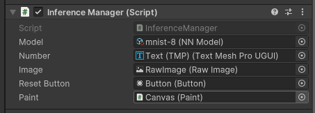

# Unity Barracuda Test

This is a test project for the Barracuda package.

# Demo

## number inference

# requirements

* Unity 2022.2.0f1

# how to set up

1. download onnmnist model from [here](https://github.com/onnx/models/tree/main/vision/classification/mnist)
2. Import the model to Assets/_Project/ONNX and set it to Model in `Inference Manager` as shown in the image below.

